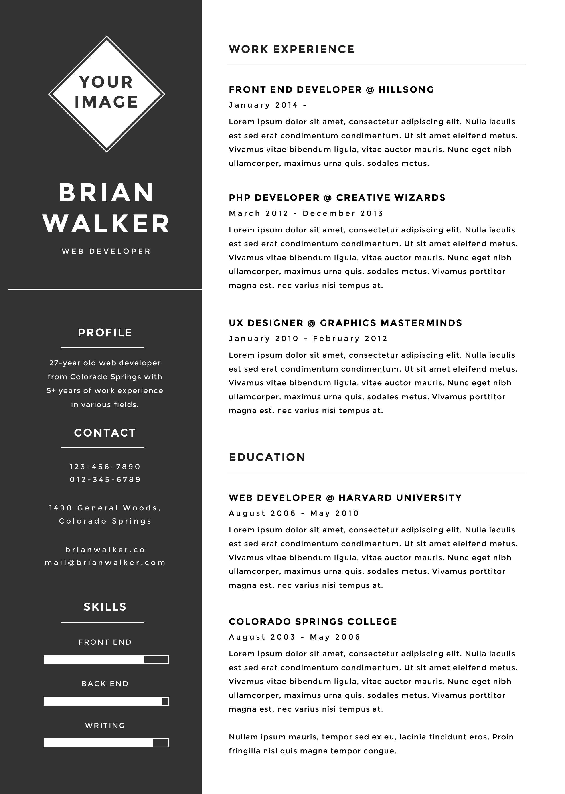

***Main project:***
&nbsp;&nbsp;
[**`challenges-accepted`**](https://github.com/AndersonMamede/challenges-accepted)

***My response:***
&nbsp;&nbsp;
[**`Run App/Demo`**](https://blog.andersonmamede.com.br/challenge-b2w-user-profile/app/build/)
&nbsp;&nbsp;
[**`Source Code`**](https://github.com/AndersonMamede/challenge-b2w-user-profile/tree/master/app)

> *Companny: [B2W](https://ri.b2w.digital/)* 
> *Original challenge description: [link](https://github.com/b2w-marketplace/code-challenge)* 

## Challenge: B2W User Profile

***Stack**: React, Sass* 

The goal is to create a client-side application to consume an API and to show its data in the user profile. This application must work on the latests browsers.

Layout is already defined:

[PSD file](https://github.com/AndersonMamede/challenge-b2w-user-profile/blob/master/layout-psd.psd) is also available.

This is the [API endpoint](http://www.mocky.io/v2/5a5e38f3330000b0261923a5).

## Requirements

* Use a CSS preprocessor, preferably Sass (feel free to use a CSS lib/framework)
* Application must have great user experience, no matter the device
* You can use Angular or React
* Create a build of your project in a folder called 'dist'
* Don't forget to add instructions on how to deploy and run your project
